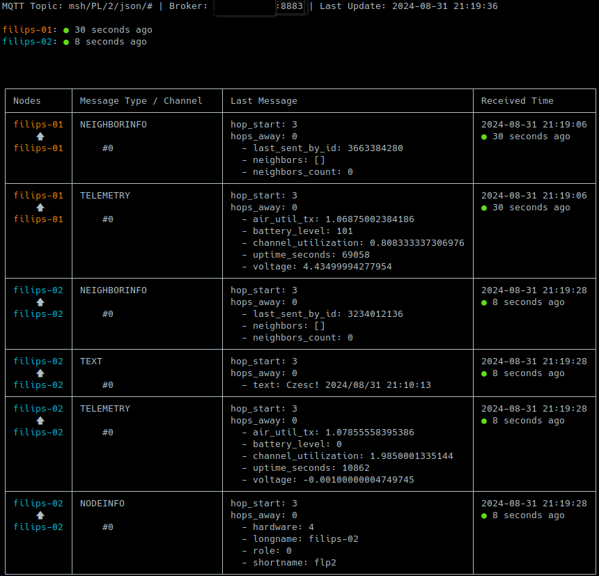

# MQTT Node Monitor for Meshtastic

## Overview

This program connects to an MQTT broker to monitor messages from [Meshtastic](https://meshtastic.org/) nodes. It displays the data in a terminal-based interface, providing both a summary of the last message from each node and a detailed table of all messages. The program uses color-coded dots to indicate the age of the last message, making it easy to see the freshness of the data at a glance.



## Features

- **Real-time Monitoring**: Continuously listens to an MQTT topic and processes messages as they arrive.
- **Alias Mapping**: Converts node IDs to human-readable names using an alias map.
- **Message Age Indication**: Uses colored dots to indicate how recent each message is, with colors ranging from green (very recent) to black (older than 2 hours).
- **Configurable**: All MQTT settings and node configurations are managed via a configuration file (`config.py`).

## Requirements

This program requires Python 3.x. You will also need to install the following Python packages:

- `paho-mqtt`: For connecting to and interacting with the MQTT broker.
- `termcolor`: For printing colored text in the terminal.
- `tabulate`: For formatting data into a nice-looking table.

### Installation of Required Packages

You can install the required packages using pip:

```bash
pip install paho-mqtt termcolor tabulate
```

## Configuration

The program relies on a configuration file (`config.py`) to specify MQTT settings, alias mappings, and color mappings. Below is an example of what your `config.py` should look like:

```python
# Define MQTT settings
MQTT_BROKER = "your_mqtt_broker_address"
MQTT_PORT = 8883
MQTT_TOPIC = "your/mqtt/topic/#"
MQTT_USERNAME = "your_mqtt_username"
MQTT_PASSWORD = "your_mqtt_password"

# SSL Usage
USE_SSL = True

# Alias mapping for node IDs to human-readable names
ALIAS_MAP = {
    "!node1id": "Node 1",
    "!node2id": "Node 2",
    # Add more node IDs and corresponding aliases here
}

# Color mapping for aliases
COLOR_MAP = {
    "Node 1": "yellow",
    "Node 2": "cyan",
    # Add more aliases and corresponding colors here
}

# Fields to ignore in the message display
IGNORE_FIELDS = ['from', 'to', 'type', 'id', 'timestamp', 'node_id']
```

### Explanation of Configuration Parameters

- **MQTT_BROKER**: The address of your MQTT broker.
- **MQTT_PORT**: The port used by your MQTT broker (default for MQTT over SSL is 8883).
- **MQTT_TOPIC**: The MQTT topic to subscribe to (wildcards can be used to subscribe to multiple topics).
- **MQTT_USERNAME**: Your MQTT username.
- **MQTT_PASSWORD**: Your MQTT password.
- **USE_SSL**: Boolean value to indicate if SSL should be used.
- **ALIAS_MAP**: A dictionary mapping node IDs to human-readable names.
- **COLOR_MAP**: A dictionary mapping node aliases to colors for terminal display.
- **IGNORE_FIELDS**: List of fields in the MQTT message that should be ignored in the display.

## Running the Program

To run the program, simply execute the Python script in your terminal:

```bash
python meshmqttmonitor.py
```

Ensure that the `config.py` file is in the same directory as your script. The file `config.py.txt` is provided as an example.

## License

This project is licensed under the MIT License.
